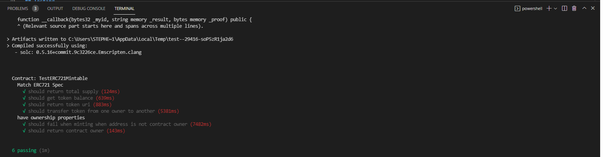
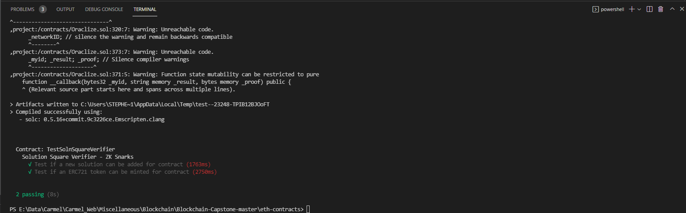
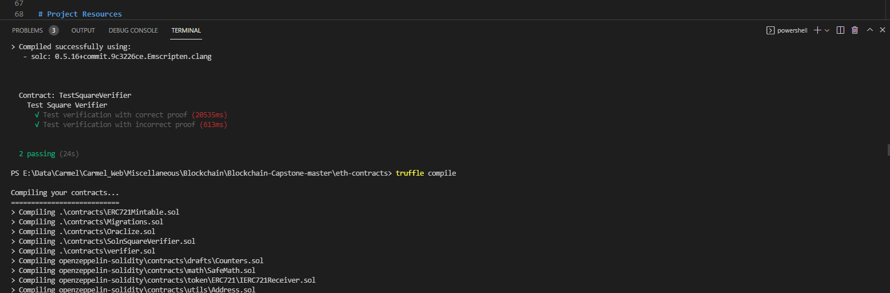
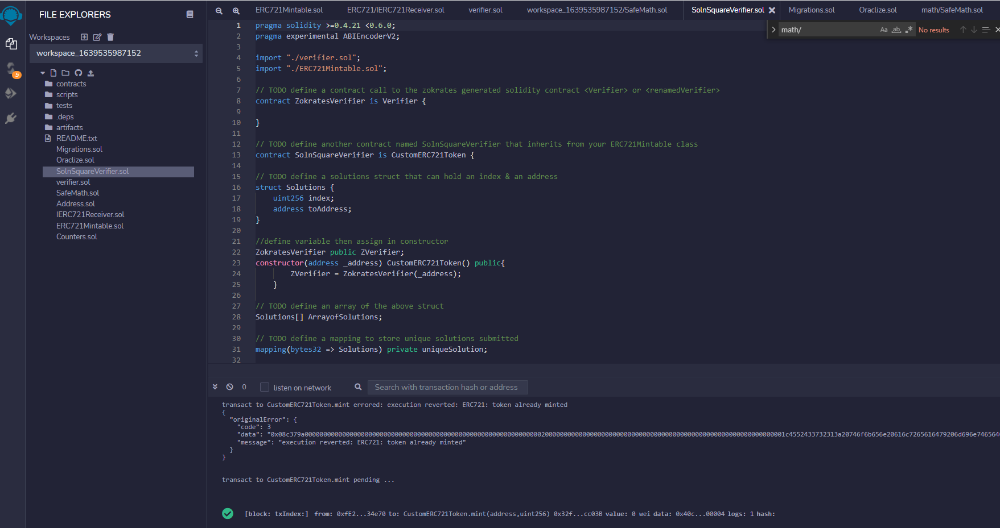
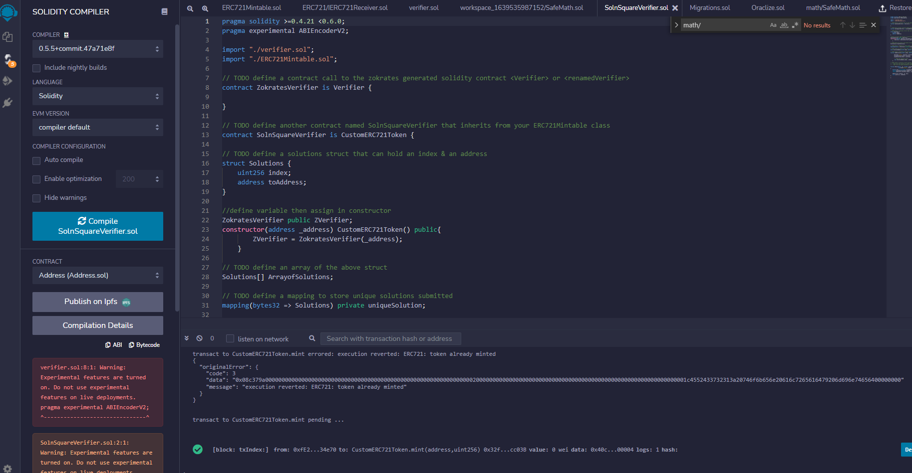
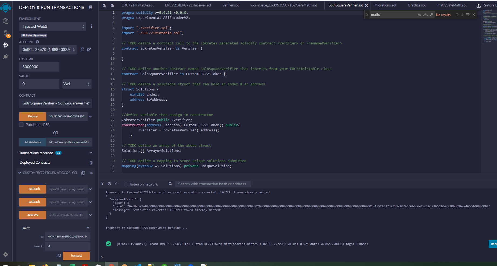
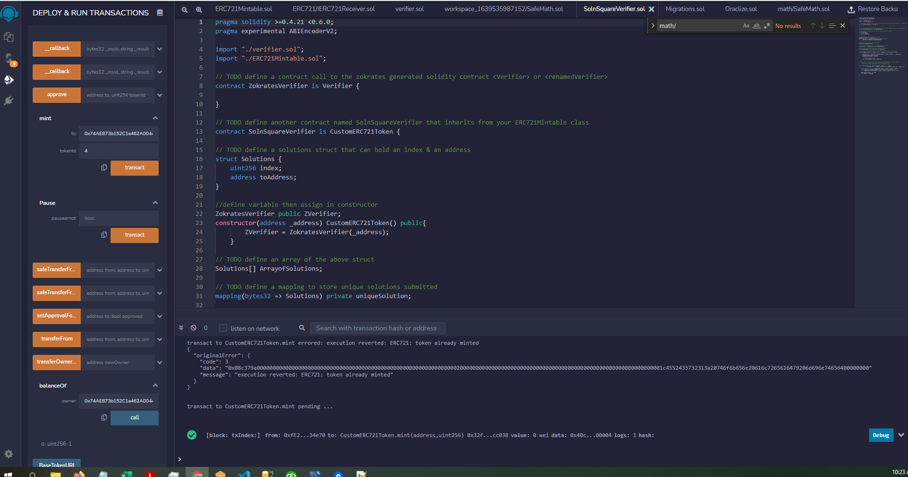

# Udacity Blockchain Capstone

The capstone will build upon the knowledge you have gained in the course in order to build a decentralized housing product. Each house is 
represented by an ERC721 non-fungible token. Before a token can be minted, the owner needs to be verified using zkSnarks. 

## Install

Download the code from from this repo: . Then, open it locally within Visual Studio Code as a workspace. Next, open Terminal mode and run the following to install all the proper libraries. Make sure Truffle and Truffle-HDWallet libraries are installed:

```shell script
npm install
```

1. Run Ganache (either from CLI or the UI)

2. Inside the Terminal, cd to the "eth-contracts" directory then run:

```shell script
truffle compile
```

This will create all of the smart contract artifacts in the proper directories.

3. Deploy to Truffle. Make sure the proper localhost URL and port number to Truffle are specified in the truffle-config.js file. Also, make sure to copy the latest mnemonic to this same file:

```shell script
truffle migrate --network development
```

## Create zkSnarks Proof Using Zokrates 

zkSnarks is usef for enhancing privacy and scalability in the blockchain space. It will be used enhance the privacy of the real estate contracts in this project.

1. Install Docker to easily deploy Zokrates via a container

2. Run Zokrates in the container using the following command line code:

```shell script
docker run -v <path to your project folder>:/home/zokrates/code -ti zokrates/zokrates /bin/bash
```

3. There is a 5-step process to creating the correct Zokrates files:

a. Compile Program
b. Trusted Setup
c. Compute-Witness
d. Generate-Proof
e. Export-Verifier

4. Compile the program written in Zokrates DSL:

```shell script
cd code/square

~/zokrates compile -i square.code
```

5. Generate the trusted setup:

```shell script
~/zokrates setup
```

6. Compute the witness:

```shell script
~/zokrates compute-witness -a 3 9
```

5. Generated proof:

```shell script
~/zokrates generate-proof
```

5. Export verifier:

```shell script
~/zokrates export-verifier
```

This should end up creating a file within the zokrates\code\square directory called "verifier.sol". This is the solidity file that is used to secure the contract.


## Testing

There are 3 separate test files to run. Start by testing the TestERC721Mintable class:

```shell script
truffle test test/TestERC721Mintable.js
```

This should return 6 successful test results:



Next, test the TestSolSquareVerifier class:

```shell script
truffle test test/TestSolSquareVerifier.js
```

This should return 2 successful test results:



Finally, test the TestSquareVerifier class:

```shell script
truffle test test/TestSquareVerifier.js
```

This should return 3 successful test results:




## Deployment to Rinkeby Test Network

1. Goto Infura.io and create an account if you already have not done so. This web service is a bridge between your application and the Rinkeby test blockchain network. Create a project in Infura and copy the Rinkeby network URL into the truffle-config.js file (or the hidden environment file). 

2. Make sure Metamask is installed as a plug-in in the Chrome browser. Copy the Metamask mnemonic into the hidden environment file, too. Connect the Metamask account to Rinkeby.

3. Run the following command to create a new contract(s) on the Rinkeby network:

```shell script
truffle migrate --network rinkeby --reset
```

## Mint a Token Using Remix

The easiest way to interact with the smart contracts after deploying them to the Rinkeby network is by using Remix, the Solidity IDE. Go to https://remix.ethereum.org/ and create a new workspace. Then, copy the main .sol contract files located in the contracts directory and also several supporting files. See the image below for all of the required files. You will also need to change some of the import statements to find the new relative locations of the supporting files in Remix:



Next, select the SolnSquareVerifier.sol file and select the Solidity Compiler option then press the Compile button to compile this file. You may get some warnings but not errors if you properly updated the relative file locations.



Next, select the Deploy and Run Transactions option. Make sure to select "Injected Web3", then select your account address from the dropdown. Select the SolnSquareVerifier contract in the contract dropdown. Then, click the Deploy button to deploy it to Rinkeby. Under the list of Deployed Contracts, select the first option, then you should see a list of all of the exposed functions from this smart contract. 




Under the Mint function option, enter the your account address and a token id (from 1 to 5). Then, click transact. This will create a new transaction that mints a token associated with an image (NFT). 



Here is what it looks like in Etherscan. You can see that 4 tokens have been minted:


## Sell it on OpenSea

Now that the tokens have been minted and are assigned to real estate images, they can be offered for sale on OpenSea. Since we are using the test networks, the same can be done on the OpenSea network.

On the item detail page, click "Sell". This will walk you through the steps for selling an item. Note that the first time you auction an item, you will need to complete several MetaMask transactions in order to give the exchange contracts access to your items. After you complete these initial steps, creating an auction will only require signing a MetaMask message. This means that you can auction items without paying gas.

Once an account has been created on OpenSea, then the easiest way to assign tokenized objects to it is by including the contract address and token id in the proper url. Here's an example of one:

```shell script
https://testnets.opensea.io/assets/0x32f2330b649a9bfce5c90b2eaaf10dc8998cc03b/5
```

The first part of the URL includes the Rinkeby contract address. The second part includes the token id. Below is a screenshot of a couple of tokenized images:


# Project Resources

* [Remix - Solidity IDE](https://remix.ethereum.org/)
* [Visual Studio Code](https://code.visualstudio.com/)
* [Truffle Framework](https://truffleframework.com/)
* [Ganache - One Click Blockchain](https://truffleframework.com/ganache)
* [Open Zeppelin ](https://openzeppelin.org/)
* [Interactive zero knowledge 3-colorability demonstration](http://web.mit.edu/~ezyang/Public/graph/svg.html)
* [Docker](https://docs.docker.com/install/)
* [ZoKrates](https://github.com/Zokrates/ZoKrates)
